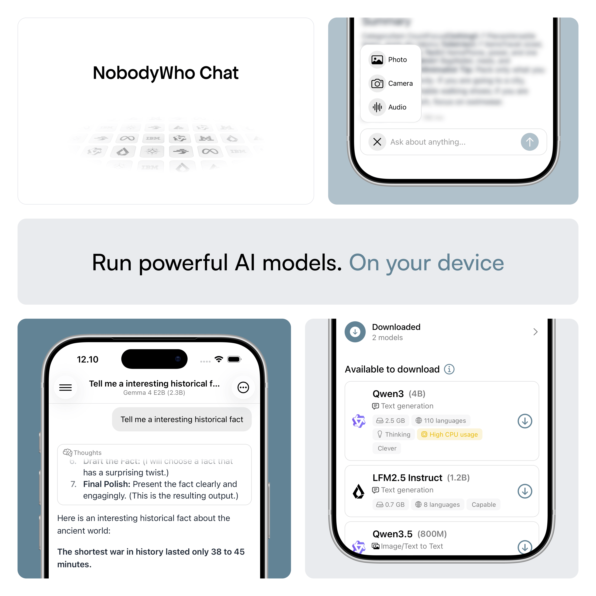

[](https://discord.gg/qhaMc2qCYB)
[](https://matrix.to/#/#nobodywho:matrix.org)
[](https://mastodon.gamedev.place/@nobodywho)
[](https://docs.nobodywho.ooo)

# NobodyWho Chat

NobodyWho Chat is a fully offline, private AI assistant that runs entirely on your device. Every conversation happens locally: no data leaves your phone, no internet connection is required, and there are no accounts, subscriptions, or hidden costs.

It's built with **[NobodyWho](https://github.com/nobodywho-ooo/nobodywho)**, a library designed to run LLMs locally and efficiently on any device.

## Features

- **Fully Private & Offline**: all conversations and data stay on your device; no conversation is collected, shared, or sent to the cloud, and the chat works without an internet connection
- **Free & Open**: no sign-ups, subscriptions, or paywalls
- **Chat** — stream responses from a local LLM in real time
- **Industry-leading models** — download and use several powerful LLMs, including thinking models
- **Tool calling**: give the model access to custom functions (e.g. weather, historical facts, stock prices...)
- **Vision & Hearing** — image & audio ingestion with a multimodal model

## 1. Getting Started

Install dependencies with `npm install`.

For iOS, install pods: `cd ios && pod install && cd ..`

### 2. Sentry

Inside `android` and `ios` folder, create `sentry.properties` file and paste the following:

```
defaults.url=https://sentry.io/
defaults.org=example-org
defaults.project=example-project
auth.token=sntrys_YOUR_TOKEN_HERE
```

### 3. Run the App

```sh
# Android
npm run android

# iOS
npm run iOS
```

**Note:** 

For iOS, if you have issues with metro, run `npm start` and then run the project on Xcode.

The script `Copy Optional Assets` in `Xcode > Build Phases` copies files in `assets` folder (in debug mode only). On Android, this step is achieved with `assets.srcDirs += ["$rootDir/../assets"]` in `build.gradle`.

#### Miscellaneous

Update tests

```sh
npm run test-update
```

iOS cleanup

```sh
make ios-clean
```

Watchman cleanup

```sh
make clean
```

### 4. Build the App

Build Android

```sh
make android-apk
```

Install apk on android

```sh
adb install android/app/build/outputs/apk/release/app-release.apk
```

```sh
make android-aab
```

For iOS, run prod scheme on Xcode.